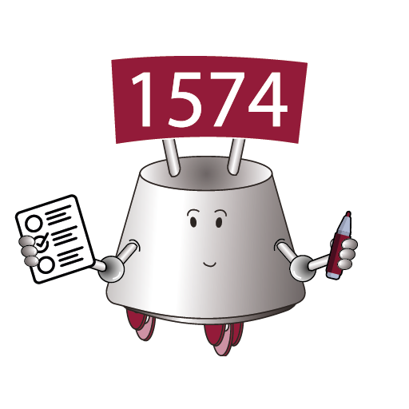

<h1 align="center">
    
    <br />
    Scouting
    <br />
      
    
    
</h1>

<h4 align="center">
    A website and PWA for scouting teams at FRC competitions built with <a href="https://angular.io">Angular</a>, <a href="https://material.angular.io">Material</a> and <a href="https://firebase.google.com">Firebase</a>
</h4>

<p align="center">
    💡 <a href="#features">Features</a>
    &nbsp;&middot&nbsp;
    🏃 <a href="#getting-started">Getting Started</a>
    &nbsp;&middot&nbsp;
    🚗 <a href="#roadmap">Roadmap</a>
    &nbsp;&middot&nbsp;
    ⚠️ <a href="#common-issues">Common Issues</a>
    &nbsp;&middot&nbsp;
    ❓ <a href="#frequently-asked-questions">FAQ</a>
</p>

## Features

- Customizable Schema

  - Sections and widgets can be customized to fit your team's analysis criteria.
  <p align="center">
     
  </p>

- Offline Work
- Simple Cross-Platform Installation
- Completions and Verification using The Blue Alliance
- Quick Overview of Missing and Invalid Scouts

<p align="center">
   
</p>

- In-App Schema Editor
- Minigames

<p align="center">
   
</p>

- Security

## Getting Started

- Download the repository, either with `git clone https://github.com/miscar/Scouting` or by downloading the zip archive from GitHub.
- Install [NodeJS](https://nodejs.org/en/download/) and the Node Package Manager.
- Install Scouting's dependencies by running `npm install` in the command-line inside the repository. You may need to run `npm install --force`.
- Create a new project by running `npm run create`.
- Open the [Firebase Console](https://console.firebase.google.com).
- Enable Cloud Firestore by clicking `Firestore Database` in the side panel and then `Create database`. You may start in production/test mode (this will get overridden upon deploy), and pick your own Cloud Firestore location.


- Enable Firebase Authentication by clicking `Authentication` in the side panel and then `Get started`.


- Enable Google Authentication by clicking `Google` under `Additional providers`, and then `Enable`. Select a project support email and then hit `Save`. Make sure you're in the `Sign-in method` tab.


- Deploy the app to Firebase Hosting and the firestore rules by running `npm run deploy`.
- Sign in with your Google Account to the live instance, find the UUID in Firebase Authentication and enter it into an "admins" document in the "admin" collection inside an array called `users`.
- That's it! You now have a fully usable Scouting instance.

### Dashboard

You may create a copy of [this](https://docs.google.com/spreadsheets/d/1NOD7aGRPPc0cSSQ7eraKIjULRJrQ1xT-7rlkZ3AyF1I/edit?usp=sharing) Google Sheets document which contains a basic Google Apps Script to fetch all of the data from Firestore.
To set it up, you'll need to get your Firebase service worker and plug it into the script.

- Open the Firebase project settings:


- Open the service accounts tab:


- Open the script like so:


- Paste the service account mail into the Google Apps Script placeholder.
- Click `Generate new private key`, then `Generate key` and open the JSON file.
- Copy the `project_id` and `private_key` (from `----BEGIN` to `-----END`) exactly as they are into the Google Apps Script placeholders.

## Common Issues

**Problem**

`Could not log in because of a FirebaseError: Firebase: Error (auth/configuration-not-found)` shows as an error in the console when trying to sign in with Google.

**Solution**

Enable Google Authentication inside Firebase, as instructed [above](#getting-started).

**Problem**

`Warning: initial exceeded maximum budget.` shows up when building/deploying.

**Solution**

Scouting is currently a big application. You can safely ignore this warning.

**Problem**

`Error: src/app/services/the-blue-alliance.service.ts:4:21 - error TS2307: Cannot find module 'environments/secrets.json' or its corresponding type declarations.` shows up when building/deploying.

**Solution**

Create a `secrets.json` file with the contents:

```json
{
  "TBAKey": "<Your TheBlueAlliance Read v3 API Key without <> here>"
}
```

**Problem**

```
Error: Failed to create project. See firebase-debug.log for more info.
node:child_process:826
    err = new Error(msg);
```

when running `npm run create` to set up a new Scouting instance.

**Solution**

Your Google Organization probably blocks creating Firebase projects. Run `firebase logout` and try signing in with a different Google account.

## Frequently Asked Questions

**How do you view submitted scout data?**

A quick overview of invalid scouts (where the team number doesn't match the match teams from The Blue Alliance) and missing scouts (where the match has some scouts but not of all teams) appear in the Admin Panel.

The data is stored in Cloud Firestore, where each event creates its own collection (You may need to refresh after the first event scout).

You may also use our Google Sheets template linked [above](#dashboard).

## Roadmap

The following things can greatly improve the quality of the application:

- [ ] Add unit tests.
- [ ] Reduce bundle size.
- [ ] Simplify the Getting Started process.
- [ ] Add more games.

## License

MIT
