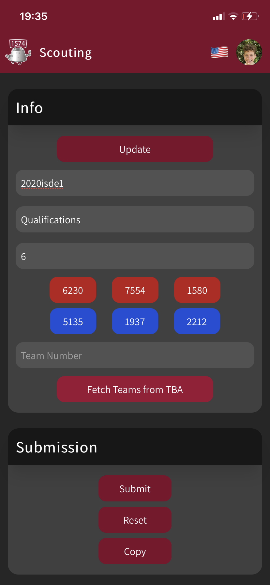
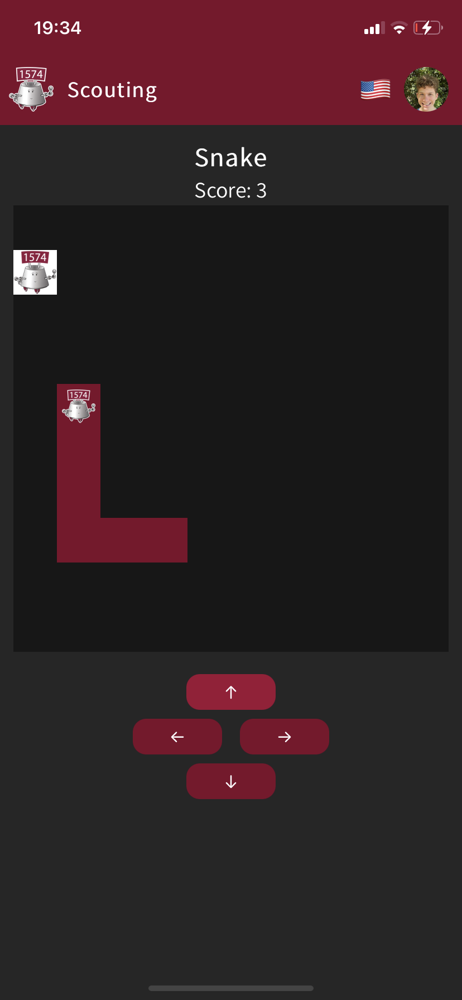
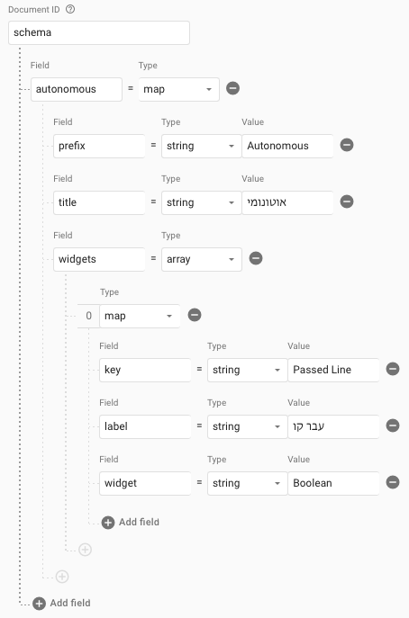

# MisCar Scouting

Scouting is a React website and PWA for scouting teams at FRC competitions. It allows you to have a group of people scouting teams and send their scouts to a central server on Firebase.

Scouting is modular and you can pick your own criteria and sections - you can use the usual Autonomous/TeleOperated/Endgame, or an additional Extra section - however you'd like. You can pick from any of the available widgets - a boolean input (toggle), a counter and a timer. Additional widgets are simple to implement, so feel free to send a PR!

## Features

-   Retain values between phone or app restarts using local storage
-   Update match scouts and protect against duplicates in Firestore
-   Dark mode (don't worry, light mode is available)


-   Fetch match teams from The Blue Alliance



-   Minigames in case of delays



## Getting Started

### Clone the Repository

-   Make sure you have Git installed.
-   Run `git clone https://github.com/miscar/scouting`.

### Install the Dependencies

-   Scouting requires [NodeJS](https://nodejs.org/en/download) and [Yarn](https://yarnpkg.com/lang/en/docs/install) installed. If you don't have them yet, please install them before continuing.
-   Run `yarn install` inside the scouting directory (if you've just cloned, you need to run `cd scouting`).
-   Create a `.env.local` file and paste the following inside:

```
REACT_APP_API_KEY="XYZ"
REACT_APP_AUTH_DOMAIN="XYZ"
REACT_APP_PROJECT_ID="XYZ"
REACT_APP_STORAGE_BUCKET="XYZ"
REACT_APP_MESSAGING_SENDER_ID="XYZ"
REACT_APP_APP_ID="XYZ"
REACT_APP_TBA_AUTH_KEY="XYZ"
```

### Create a Firebase Project

-   Go to the [Firebase Console](https://console.firebase.google.com) and click "Add Project".
-   Give it some proper name. You can enable or disable Google Analytics, it is not required for Scouting.
-   After your project is created, click the "Web" icon to register the web app.


-   Give it some proper name and **enable** Firebase Hosting for the app!
-   Copy the resulting API Key, Auth Domain, Project ID, Storage Bucket, Messaging Sender ID and App ID to the `.env.local` file instead of `XYZ`.
-   Open Firestore and click "Create database". You can select "Start out in production mode" because the correct Firestore Rules will be uploaded from the local project (Notice `firestore.rules`)


-   Click "Start collection" and give it the ID "admin". As the Document ID, enter "version" and add the field "version" of type string with the value "1.0.0". You can update this value whenever a new update arrives for Scouting to send notifications to users so they update.
-   Inside the "admin" collection click "Add document" and give it the ID "schema". It will need fields similar to the following:



### Create a TBA Authentication Key

-   Inside your [Account Page](https://www.thebluealliance.com/account), under "Read API Keys", choose some description (e.g. "Scouting") and click "Add New Key".
-   Copy the value under "X-TBA-Auth-Key" into `.env.local` in the `REACT_APP_TBA_AUTH_KEY`.

### Final Deployment

-   Inside the `scouting` directory, run `yarn run firebase login` to sign in with Google and then `yarn run firebase use --add` to select the project you've just created.
-   Run `yarn deploy`.
-   You're done! You should see the live link of your very own Scouting instance.

## Customizing

-   If using this for your own team, you should probably change the following
    -   Inside the [manifest](./public/manifest.json) you can change the theme and background colors as well as the icon
    -   You can also swap the `favicon.ico` and `icon.png` files in the [public](./public) directory
    -   You can change the custom colors in [the tailwind configuration](./tailwind.config.js)
    -   You can change the font family by swapping the Google Fonts import in [the index](./public/index.html) and the [CSS](./src/index.css)
    -   You can set `REACT_APP_DEFAULT_LANGUAGE` in the `.env` files to one of the supported languages to set the initial user language. We currently support Hebrew ("he") and English ("en")

## Roadmap

-   [ ] Use css/sass instead of tailwindcss to improve speed
-   [ ] Separate UI from business logic
-   [ ] Create a custom backend as a Firebase alternative
-   [ ] Add Simon minigame
