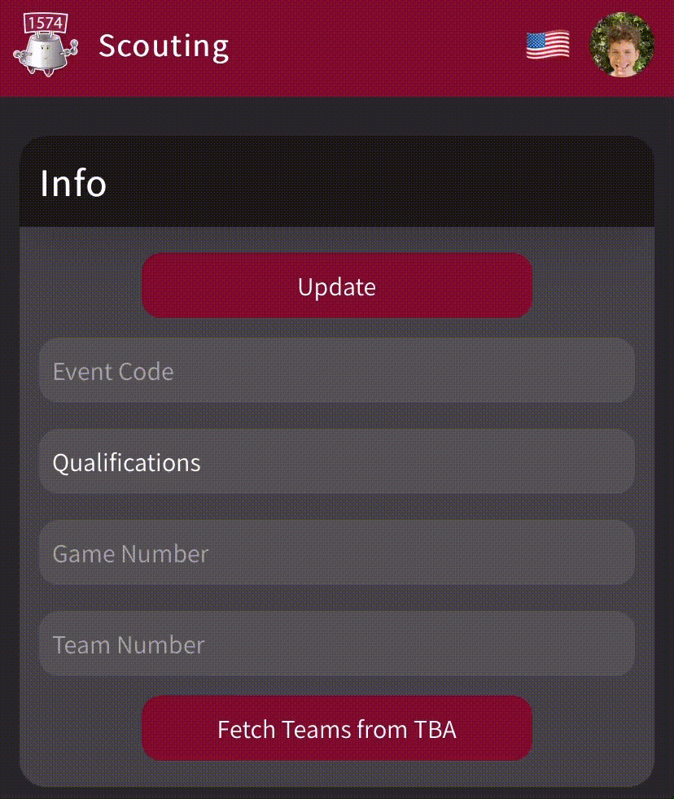

<h1 align="center">
    
    <br />
    Scouting
    <br />
    
    
</h1>

<h4 align="center">
    A website and PWA for scouting teams at FRC competitions built with <a href="https://tailwindcss.com">Tailwind</a>, <a href="https://reactjs.org">React</a> and <a href="https://firebase.google.com">Firebase</a>
</h4>

<p align="center">
    <a href="#features">Features</a>
    &middot
    <a href="#getting-started">Getting Started</a>
    &middot
    <a href="#customizing">Customizing</a>
</p>

## Features

<p align="center">
    Create your own criteria and data to track    
    <br />
    Retain values between phone or app restarts using local storage
    <br />
    Update match scouts and prevent duplicates in Firestore
    <br />
    <br />
    Multiple languages
    <br />
    <br />
    
    <br />
    Fetch match teams from The Blue Alliance
    <br />
    <br />
    
    <br />
    Minigames (with leaderboards!) in case of delays
    <br />
    <br />
    
</p>

## Getting Started

For automatic setup, run the `setup.py`!
It should be enough to get going.
Manual setup steps are available [here](./docs/MANUAL.md).

## Customizing

-   If using this for your own team, you can change the following
    -   Most importantly, play around with the `schema.json` file and run `yarn deploy:schema` when you're satisfied with your criteria
    -   Inside the [manifest](./public/manifest.json) you can change the theme and background colors as well as the icon
    -   You can also swap the `favicon.ico` and `icon.png` files in the [public](./public) directory
    -   You can change the custom colors in [the tailwind configuration](./tailwind.config.js)
    -   You can change the font family by swapping the Google Fonts import in [the index](./public/index.html) and the [CSS](./src/index.css)
    -   You can set `REACT_APP_DEFAULT_LANGUAGE` in the `.env` files to one of the supported languages to set the initial user language. We currently support Hebrew ("he") and English ("en")

### Enable TBA Team Suggestions

-   Inside your [Account Page](https://www.thebluealliance.com/account), under "Read API Keys", choose some description (e.g. "Scouting") and click "Add New Key".
-   Copy the value under "X-TBA-Auth-Key" into `.env.local` in the `REACT_APP_TBA_AUTH_KEY`.

## Changing the Schema

Edit the `schema.json` file and change it to match your own criteria.
It is pretty self-explanatory:

```json
{
    "sections": [
        {
            "prefix": "Autonomous",
            "title": "Autonomous",
            "widgets": [
                {
                    "key": "Passed Line",
                    "label": "Passed Line",
                    "widget": "Boolean"
                },
                {
                    "key": "Points Scored",
                    "label": "Points Scored",
                    "widget": "Counter"
                },
                {
                    "key": "Started",
                    "label": "Started At",
                    "widget": "Timer"
                }
            ]
        },
        {
            "prefix": "TeleOperated",
            "title": "TeleOperated",
            "widgets": [
                {
                    "key": "Started",
                    "label": "Started At",
                    "widget": "Timer"
                }
            ]
        }
    ]
}
```

When you're done, run `yarn deploy` to push the changes to your users. You may also want to go to the Firebase website, and alter the version in `admin/version` so your users know to update.

## License

MIT
