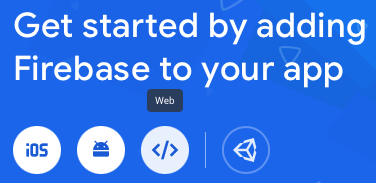
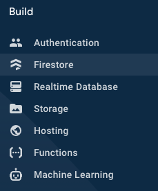

# Manual Setup

### Clone the Repository

-   Make sure you have Git installed.
-   Run `git clone https://github.com/miscar/scouting`.

### Install the Dependencies

-   Scouting requires [NodeJS](https://nodejs.org/en/download) and [Yarn](https://yarnpkg.com/lang/en/docs/install) installed. If you don't have them yet, please install them before continuing.
-   Run `yarn install` inside the scouting directory (if you've just cloned, you need to run `cd scouting`).
-   Create a `.env.local` file and paste the following inside:

```
REACT_APP_API_KEY="XYZ"
REACT_APP_AUTH_DOMAIN="XYZ"
REACT_APP_PROJECT_ID="XYZ"
REACT_APP_STORAGE_BUCKET="XYZ"
REACT_APP_MESSAGING_SENDER_ID="XYZ"
REACT_APP_APP_ID="XYZ"
REACT_APP_TBA_AUTH_KEY="XYZ"
```

### Create a Firebase Project

-   Go to the [Firebase Console](https://console.firebase.google.com) and click "Add Project".
-   Give it some proper name. You can enable or disable Google Analytics, it is not required for Scouting.
-   After your project is created, click the "Web" icon to register the web app.



-   Give it some proper name and **enable** Firebase Hosting for the app!
-   Copy the resulting API Key, Auth Domain, Project ID, Storage Bucket, Messaging Sender ID and App ID to the `.env.local` file instead of `XYZ`.
-   Open Firestore and click "Create database". You can select "Start out in production mode" because the correct Firestore Rules will be uploaded from the local project (Notice `firestore.rules`)



-   Click "Start collection" and give it the ID "admin". As the Document ID, enter "version" and add the field "version" of type string with the -value "1.0.0". You can update this value whenever a new update arrives for Scouting to send notifications to users so they update.

### Create a TBA Authentication Key

-   Inside your [Account Page](https://www.thebluealliance.com/account), under "Read API Keys", choose some description (e.g. "Scouting") and click "Add New Key".
-   Copy the value under "X-TBA-Auth-Key" into `.env.local` in the `REACT_APP_TBA_AUTH_KEY`.

### Specifying Domain

Change the line `request.auth.token.email.matches(".*@miscar1574[.]org");` inside `firestore.rules` to match your team's address.
If you don't have an adress, you may remove the statement from the `if` block like so:
```
function isValidUser(request) {
    return request.auth.uid != null;
}
```
However, any user signed up to your Firebase project will be able to see the schema and scout for you.

### Final Deployment

-   Inside the `scouting` directory, run `yarn run firebase login` to sign in with Google and then `yarn run firebase use --add` to select the project you've just created.
-   Run `yarn deploy` and `yarn deploy:schema`. Changing your schema is as simple as editing `schema.json` and running `yarn deploy:schema` again.
-   You're done! You should see the live link of your very own Scouting instance.
